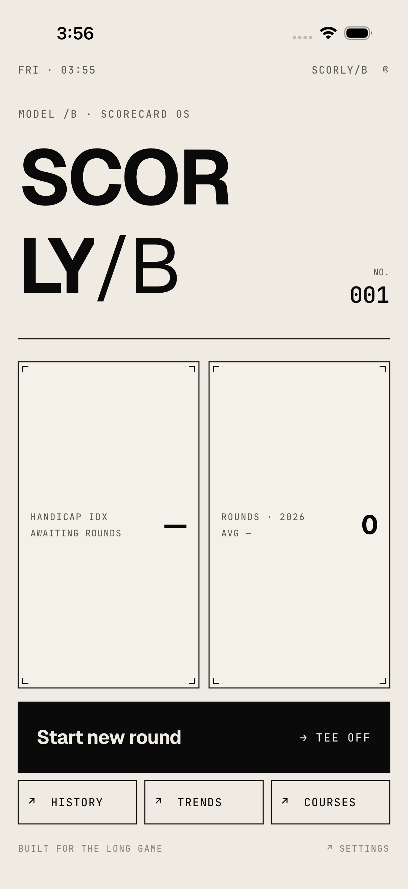
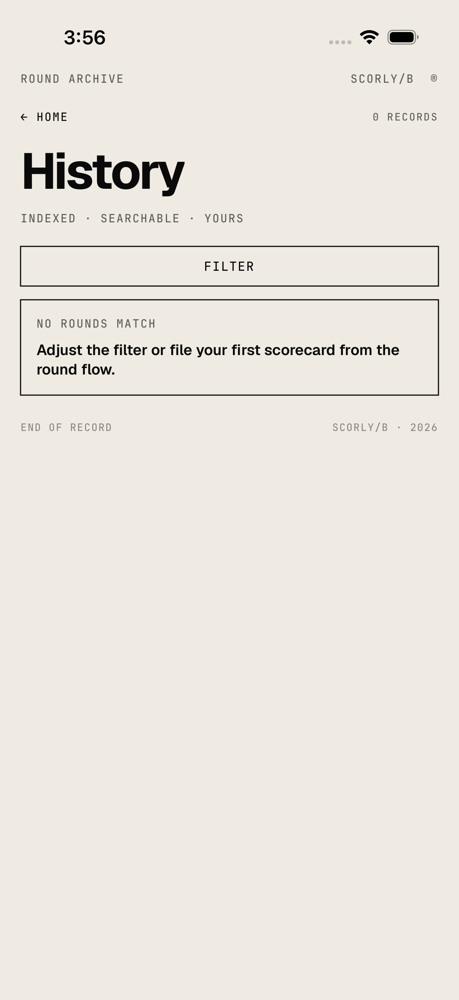
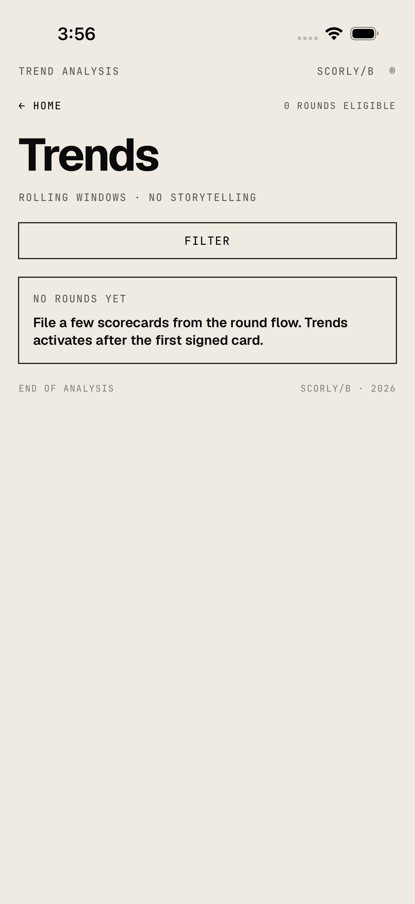
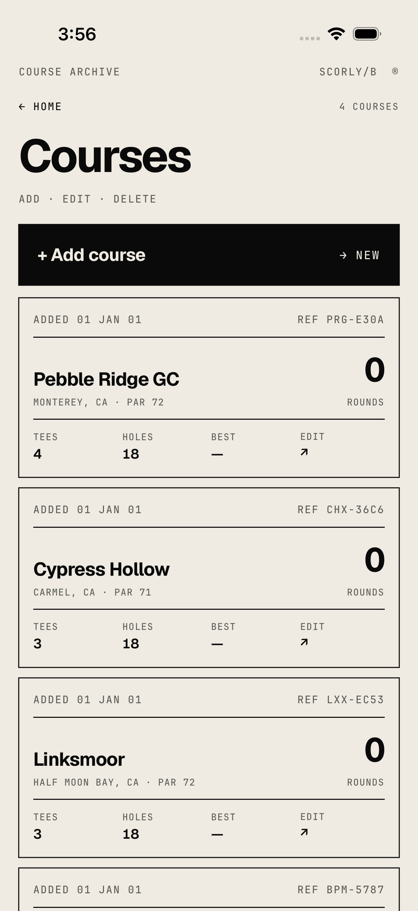

# Scorly

A little iOS app I'm building to track my golf rounds — scorecard, shot-by-shot
tracking, putting, penalties, and some basic stats afterwards (strokes gained,
GIR, accuracy trends, etc).

## Screens

  
  
  
  

## What it does

- Set up a round (course, tees, players, conditions) and play it hole by hole
- Track shots, putts, chips/pitches, and penalties as you go
- Live scorecard with running stats while you play
- Sign and save the round when you're done
- History of past rounds with a detail view per round
- Stats tab with trends across rounds
- Basic course management (add/edit courses and tees)
- Syncs to a Supabase backend so rounds aren't just stuck on one device

## Stack

- SwiftUI, Swift 6 (strict concurrency)
- Modular Swift packages (domain, data, design system, and one package per feature)
- Supabase for auth + Postgres backend, with SQL migrations

## Project layout

- `Scorly/` — the app target (entry point, root navigation, home screen)
- `Packages/ScorlyDomain` — models and core logic
- `Packages/ScorlyData` — Supabase-backed repositories
- `Packages/ScorlyDesignSystem` — shared UI components/styling
- `Packages/ScorlyReviewKit` — shared round-review/metrics views
- `Packages/ScorlyFeature*` — one package per feature (round, history, stats, settings, courses, auth)
- `supabase/` — database migrations and seed data

Still very much a work in progress — mostly building this for myself to use
on the course.
